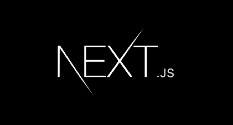

### Hi there, I'm Abin 👋

## I'm a Full Stack Developer, who love to code! 

- 💪 I’m currently learning React, Javascript, Nodejs, Firebase ,MogoDB ,Django
- 🕺🏻 I’m looking to collaborate with other passionate developers.

- 👩‍💻 2021 Goals: Master React, Complete MERN Stack ,Django. Contribute to Open Source projects.
- ⚡ I love coding it's me kind of drug to me every time i learn new things i will never ever stop learning

- 👨‍🎓 I am Doing my B.TECH in Computer Science at  Kmea Engneering  College 🧑🏽‍💻

### Languages and Tools:

<!--  -->
<!--  -->
<!--  -->
<!--  -->

 

---

# Contact

